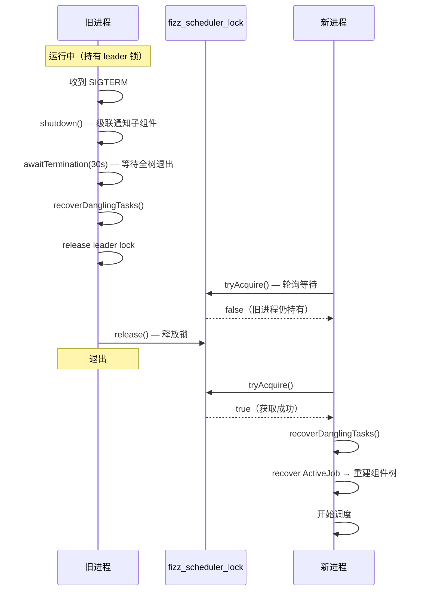

# 并发与实例控制

## 概述

本文档描述 Fizz 如何实现：

1. 单实例调度互斥（Leader 选举）
2. 滚动更新期间的安全交接
3. 进程恢复与悬空任务处理
4. 多级并行度控制（Semaphore 内存槽位）

## 一、Leader 选举与心跳

### 机制设计

使用 MySQL `fizz_scheduler_lock` 表实现分布式锁，核心思路：

- 同一时刻只有一行记录（`id = 1`）
- 持有者定期更新 `heartbeat_at`
- 新进程通过心跳超时判定旧进程是否存活

### SchedulerLockStore 接口

```java
public interface SchedulerLockStore {
    boolean tryAcquire(String instanceId, int heartbeatTimeoutSeconds);
    void updateHeartbeat(String instanceId);
    void release(String instanceId);
}
```

### 获取锁的 SQL 实现

```java
// SchedulerLockStoreImpl

public boolean tryAcquire(String instanceId, int heartbeatTimeoutSeconds) {
    // 场景 1: 表中无记录，首次启动
    int inserted = jdbc.update("""
        INSERT IGNORE INTO fizz_scheduler_lock (id, instance_id, heartbeat_at, acquired_at)
        VALUES (1, ?, NOW(3), NOW(3))
        """, instanceId);
    if (inserted > 0) return true;

    // 场景 2: 表中有记录，判断心跳是否超时
    int updated = jdbc.update("""
        UPDATE fizz_scheduler_lock
        SET instance_id = ?, heartbeat_at = NOW(3), acquired_at = NOW(3)
        WHERE id = 1 AND heartbeat_at < NOW(3) - INTERVAL ? SECOND
        """, instanceId, heartbeatTimeoutSeconds);
    return updated > 0;
}

public void release(String instanceId) {
    jdbc.update("""
        UPDATE fizz_scheduler_lock
        SET instance_id = '', heartbeat_at = '1970-01-01'
        WHERE id = 1 AND instance_id = ?
        """, instanceId);
}
```

**心跳参数：**

- 心跳间隔：每次 event loop idle 时更新（约 2 秒）
- 心跳超时：60 秒（超过 60 秒未更新视为死亡）

---

## 二、滚动更新交接流程

### 旧进程 Graceful Shutdown

通过 `SmartLifecycle.stop()` 触发：

```java
// SchedulerLifecycle Bean
@Override
public void stop() {
    scheduler.shutdown();              // 非阻塞：级联通知所有子组件
    scheduler.awaitTermination(30_000); // 阻塞：等待全树退出
}
```

Scheduler.shutdown() 级联：
```
running = false; unpark(thread)
for each TenantJobScheduler: ts.shutdown()
  → running = false; unpark(thread)
  → for each JobComponent: jc.shutdown()
    → running = false; unpark(thread)
    → for each TaskComponent: tc.cancel()
      → cancelled = true; unpark(taskThread)
```

Scheduler.awaitTermination(30s) 级联等待：
```
for each TenantJobScheduler: ts.awaitTermination(30s)
  → for each JobComponent: jc.awaitTermination(30s)
    → for each TaskComponent: tc.join(30s)
    → joinSelf(30s)
  → joinSelf(30s)
→ joinSelf(30s) + lockStore.release() + taskStore.recoverDanglingTasks()
```

### 新进程启动

```
新进程启动
  └─ scheduler.start()
      └─ beforeLoop() → recover():
          ├─ tryAcquire leader lock（轮询直到成功）
          ├─ taskStore.recoverDanglingTasks(instanceId)
          ├─ 加载 ActiveJob（PENDING + RUNNING）
          ├─ 按 (tenantId, jobType) 分组创建 TenantJobScheduler
          │   ├─ RUNNING jobs → 创建 JobComponent, tell(Activate) 恢复状态
          │   └─ PENDING jobs → addRecoveredPendingJob()
          └─ 启动 event loop 开始正常调度
```

### 悬空任务恢复

```sql
-- TaskStoreImpl.recoverDanglingTasks
UPDATE fizz_task
SET status = 'PENDING', instance_id = NULL, version = version + 1
WHERE status = 'RUNNING' AND (instance_id != ? OR instance_id IS NULL)
```

---

## 三、时序：滚动更新完整过程



---

## 四、多级并行度控制（Semaphore 内存槽位）

使用内存 Semaphore 槽位模型。

### 4.1 Job 并行度

由 `TenantJobScheduler` 控制：`Semaphore(jobConcurrency)`

```java
// TenantJobScheduler
private final Semaphore jobSlots = new Semaphore(jobConcurrency);

void tryActivate() {
    while (jobSlots.tryAcquire()) {
        PendingEntry next = pollEligible();
        if (next == null) { jobSlots.release(); return; }
        activateJob(next);  // PENDING → RUNNING in DB
    }
}

void handleJobCompleted(JobCompleted m) {
    jobSlots.release();  // 释放槽位
    tryActivate();       // 激活下一个排队 Job
}
```

- `jobConcurrency` 在 `fizz_job_type` 表中配置，含义：每个租户内此 jobType 最多同时 RUNNING 的 Job 数
- 不同 jobType 互不影响

### 4.2 Task 并行度

由 `JobComponent` 控制：`Semaphore(taskConcurrency)`

```java
// JobComponent
private final Semaphore taskSlots = new Semaphore(taskConcurrency);

void tryDispatch() {
    while (taskSlots.tryAcquire()) {
        Task task = fetchPendingTask();
        if (task == null) { taskSlots.release(); return; }
        dispatchTask(task);  // PENDING → RUNNING in DB
    }
}

void handleTaskCompleted(TaskCompleted m) {
    taskSlots.release();  // 释放槽位
    tryDispatch();        // 分发下一个 Task
}
```

- `taskConcurrency` 在 `fizz_job` 表中配置（提交作业时指定）
- 仅控制本 Job 内并发

### 4.3 Queueing Key 串行约束

相同 `queueing_key` 的作业在同 (tenant, jobType) 内互斥执行：

```java
private PendingEntry pollEligible() {
    for (PendingEntry entry : pendingFifo) {
        if (isQueueingKeyRunning(job.getQueueingKey())) continue;
        return entry;
    }
    return null;
}
```

### 并行度配置

```yaml
fizz:
  scheduler:
    heartbeat-timeout-seconds: 60
  notification:
    retry-interval-ms: 5000
    max-attempts: 10
    timeout-ms: 10000
```

并行度配置位于 `fizz_job_type.job_concurrency`（每租户同类型最大并发 Job 数）和 `fizz_job.task_concurrency`（单 Job 最大并发 Task 数）。

---

## 五、避免空转

每个组件的事件循环通过 `inbox.poll(timeout)` + `LockSupport.park/unpark` 实现事件驱动：

- 有消息时：`tell()` 投递到 inbox + `unpark` 唤醒 event loop
- 无消息时：event loop park 在 inbox.poll() 上，不消耗 CPU
- 保底超时：各组件按需设置 timeoutMs（Scheduler 2s 心跳，其他 60s 保底）

**唤醒触发点：**

| 触发源       | 触发者              | 说明                                 |
| ------------ | ------------------- | ------------------------------------ |
| 新作业提交   | JobService          | `scheduler.tell(JobSubmitted)`       |
| 任务执行完毕 | TaskComponent       | `parent.tell(TaskCompleted)`         |
| 作业取消     | JobService          | `scheduler.tell(CancelJob)`          |
| 心跳到期     | Scheduler.onIdle    | 更新 leader 心跳                    |

---

## 六、异常场景处理

| 场景               | 处理方式                                               |
| ------------------ | ------------------------------------------------------ |
| 进程被 kill -9     | 新进程等待心跳超时（60s），然后抢锁并恢复悬空任务        |
| 启动时数据库不可用 | 容器正常启动，event loop 内持续重试抢锁                  |
| 数据库短暂不可用   | event loop catch 异常，标记非 leader，sleep 后重试       |
| HTTP 调用超时      | 等同于 FAILED，进入重试流程                            |
| 新旧进程同时运行   | 只有 leader 执行调度，非 leader 在 onIdle 中等待抢锁     |
| 通知发送失败       | 固定间隔重试，最多尝试 max-attempts 次后标记 FAILED    |
