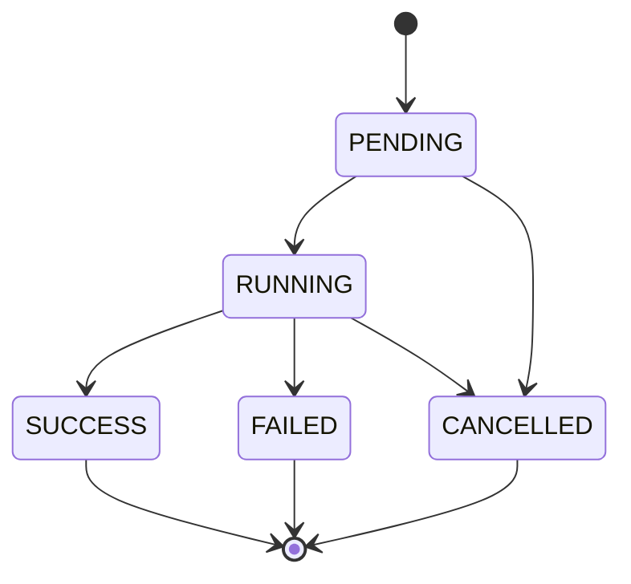
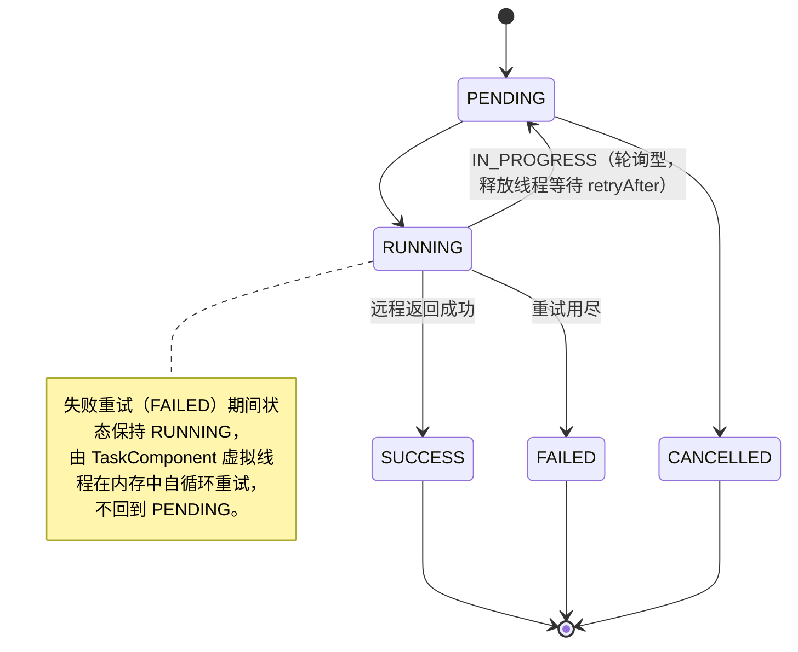
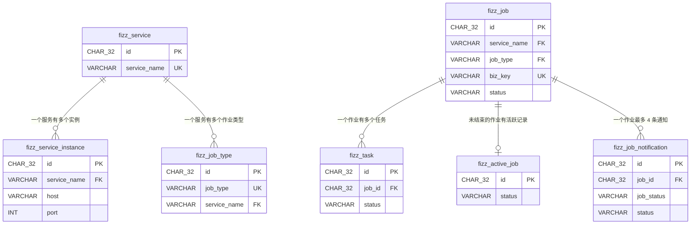

# 数据库设计

## 概述

所有表使用 InnoDB 引擎，字符集 utf8mb4。时间字段统一使用 DATETIME(3) 精确到毫秒。

**术语：** Job（作业）包含多个 Task（任务），Task 是最小执行单元。

**主键策略：** 除 `fizz_scheduler_lock`（固定单行，INT 主键）外，所有表主键使用 **UUIDv7**，类型为 `CHAR(32)`（去除连字符的 hex 表示）。UUIDv7 包含时间戳前缀，天然有序，适合 B-Tree 索引。由应用层生成，兼容 JPA batch insert。

**乐观并发控制：** 所有数据表（除 `fizz_scheduler_lock`）均包含 `version` 字段（`INT NOT NULL DEFAULT 0`），用于 CAS 乐观锁。更新时 `SET version = version + 1 WHERE version = ?`，返回 0 行表示并发冲突。JPA 通过 `@Version` 注解自动管理。

**数据访问层：** 使用 Spring Data JPA。`fizz-core` 中的 `engine` 包定义 Store 接口（如 `JobStore`、`TaskStore`）和领域枚举（如 `JobStatus`、`TaskStatus`）。`domain` 包通过 JPA Entity + Spring Data JPA Repository 实现持久化，Entity 中的状态字段直接引用 engine 定义的枚举。`service` 包实现 engine 的 Store 接口（调用 domain 包完成持久化）。批量更新、条件统计等操作使用 `@Query` 注解。

**表名前缀：** 统一使用 `fizz_` 前缀。理由：该服务通常与业务系统共享 MySQL 实例，前缀可避免表名冲突，且 grep/搜索时能快速定位所属，成本极低。

**JPA Batch Insert 配置：** 为支持大量 Task（10000+）高效写入，需配置：

```yaml
spring:
  jpa:
    properties:
      hibernate:
        jdbc.batch_size: 50
        order_inserts: true
        order_updates: true
```

UUIDv7 由应用层生成，不依赖数据库自增，天然支持 batch insert。

## 表设计

### fizz_scheduler_lock — 调度器领导锁

用于实现单实例调度互斥，保证同一时刻只有一个进程执行调度任务。

```sql
CREATE TABLE `fizz_scheduler_lock` (
    `id`             INT           NOT NULL DEFAULT 1,
    `instance_id`    VARCHAR(32)   NOT NULL COMMENT '持有锁的实例 UUID',
    `acquired_at`    DATETIME(3)   NOT NULL COMMENT '获取锁时间',
    `heartbeat_at`   DATETIME(3)   NOT NULL COMMENT '最后心跳时间',

    PRIMARY KEY (`id`),
    CONSTRAINT `chk_single_row` CHECK (`id` = 1)
)
COMMENT '调度器领导锁';
```

**设计说明：**

- 通过 `CHECK (id = 1)` 保证只有一行记录
- 新进程通过 `UPDATE ... WHERE heartbeat_at < NOW() - interval` 抢锁
- 正常退出时清空 instance_id 让出锁
- 此表无 version 字段，通过 WHERE 条件实现互斥

---

### fizz_service — 服务注册表

记录可调用的远程业务服务。一个服务名可以有多个实例，调用时轮询使用。

```sql
CREATE TABLE `fizz_service` (
    `id`              CHAR(32)      NOT NULL COMMENT 'UUIDv7',
    `service_name`    VARCHAR(128)  NOT NULL COMMENT '服务名',
    `version`         INT           NOT NULL DEFAULT 0 COMMENT '乐观锁版本号',
    `created_at`      DATETIME(3)   NOT NULL DEFAULT CURRENT_TIMESTAMP(3),
    `updated_at`      DATETIME(3)   NOT NULL DEFAULT CURRENT_TIMESTAMP(3) ON UPDATE CURRENT_TIMESTAMP(3),

    PRIMARY KEY (`id`),
    UNIQUE KEY `uk_service_name` (`service_name`)
)
COMMENT '服务注册';
```

---

### fizz_service_instance — 服务实例表

一个服务可部署多个实例，调度器调用时轮询（Round-Robin）选择实例。

```sql
CREATE TABLE `fizz_service_instance` (
    `id`              CHAR(32)      NOT NULL COMMENT 'UUIDv7',
    `service_name`    VARCHAR(128)  NOT NULL COMMENT '所属服务名',
    `scheme`          VARCHAR(10)   NOT NULL DEFAULT 'http' COMMENT '协议: http / https',
    `host`            VARCHAR(256)  NOT NULL COMMENT '实例地址',
    `port`            INT           NOT NULL COMMENT '实例端口',
    `version`         INT           NOT NULL DEFAULT 0 COMMENT '乐观锁版本号',
    `created_at`      DATETIME(3)   NOT NULL DEFAULT CURRENT_TIMESTAMP(3),
    `updated_at`      DATETIME(3)   NOT NULL DEFAULT CURRENT_TIMESTAMP(3) ON UPDATE CURRENT_TIMESTAMP(3),

    PRIMARY KEY (`id`),
    UNIQUE KEY `uk_service_host_port` (`service_name`, `host`, `port`),
    KEY `idx_service_name` (`service_name`)
)
COMMENT '服务实例表';
```

**设计说明：**

- 同一服务的多个实例通过 `service_name` 关联
- `scheme` 支持 http/https，默认 http
- 唯一约束防止同一服务重复注册相同的 host:port

---

### fizz_job_type — 作业类型配置表

定义每种作业类型的 HTTP 调用方式和重试策略。一个服务下可有多个作业类型。

```sql
CREATE TABLE `fizz_job_type` (
    `id`                    CHAR(32)      NOT NULL COMMENT 'UUIDv7',
    `job_type`              VARCHAR(128)  NOT NULL COMMENT '作业类型标识',
    `service_name`          VARCHAR(128)  NOT NULL COMMENT '所属服务名',
    `task_path`              VARCHAR(256)  NOT NULL COMMENT '任务执行 API 路径',
    `notify_path`           VARCHAR(256)  NULL COMMENT '状态通知 API 路径（可选，NULL 表示不通知）',
    `http_method`           VARCHAR(10)   NOT NULL DEFAULT 'POST' COMMENT 'HTTP 方法',
    `timeout_ms`            INT           NOT NULL DEFAULT 30000 COMMENT '单次 HTTP 调用超时(毫秒)',
    `backoff_strategy`      VARCHAR(16)   NOT NULL DEFAULT 'FIXED' COMMENT '退避策略: FIXED / EXPONENTIAL',
    `backoff_initial_ms`    INT           NOT NULL DEFAULT 10000 COMMENT '初始退避时间(毫秒)',
    `backoff_max_ms`        INT           NOT NULL DEFAULT 300000 COMMENT '最大退避时间(毫秒)，指数退避封顶',
    `job_concurrency`      INT           NOT NULL DEFAULT 10 COMMENT '每租户最大并发作业数',
    `task_concurrency`     INT           NOT NULL DEFAULT 1 COMMENT '默认任务并发度',
    `version`               INT           NOT NULL DEFAULT 0 COMMENT '乐观锁版本号',
    `created_at`            DATETIME(3)   NOT NULL DEFAULT CURRENT_TIMESTAMP(3),
    `updated_at`            DATETIME(3)   NOT NULL DEFAULT CURRENT_TIMESTAMP(3) ON UPDATE CURRENT_TIMESTAMP(3),

    PRIMARY KEY (`id`),
    UNIQUE KEY `uk_job_type` (`job_type`),
    KEY `idx_service_name` (`service_name`)
)
COMMENT '作业类型配置';
```

**退避计算逻辑：**

- `FIXED`: `available_at = now + backoff_initial_ms`
- `EXPONENTIAL`: `available_at = now + min(backoff_initial_ms * 2^(attempts - 1), backoff_max_ms)`

**状态通知：**

- `notify_path` 不为 NULL 时，Job 在 RUNNING、SUCCESS、FAILED、CANCELLED 状态变更时发送 HTTP POST 通知到该路径
- 通知目标地址复用 `service_name` 对应的服务实例（轮询选择）
- 详见「作业状态通知」章节

---

### fizz_job — 作业表

记录每个提交的作业及其当前状态。

```sql
CREATE TABLE `fizz_job` (
    `id`                  CHAR(32)      NOT NULL COMMENT 'UUIDv7',
    `tenant_id`           VARCHAR(64)   NOT NULL COMMENT '租户 ID',
    `service_name`        VARCHAR(128)  NOT NULL COMMENT '服务名',
    `job_type`            VARCHAR(128)  NOT NULL COMMENT '作业类型',
    `queueing_key`        VARCHAR(256)  NULL COMMENT '排队 key，相同 key 的作业串行执行',
    `biz_key`             VARCHAR(256)  NULL COMMENT '业务去重键，与 job_type 共同唯一',
    `task_concurrency`    INT           NOT NULL DEFAULT 1 COMMENT '任务并发度',
    `max_attempts`        INT           NOT NULL DEFAULT -1 COMMENT '任务最大尝试次数，-1 表示无限',
    `status`              VARCHAR(16)   NOT NULL DEFAULT 'PENDING' COMMENT 'PENDING/RUNNING/SUCCESS/FAILED/CANCELLED',
    `scheduled_at`        DATETIME(3)   NULL COMMENT '计划启动时间，NULL 表示立即执行',
    `total_count`         INT           NOT NULL DEFAULT 0 COMMENT '任务总数',
    `completed_count`     INT           NOT NULL DEFAULT 0 COMMENT '已完成任务数(SUCCESS)',
    `failed_count`        INT           NOT NULL DEFAULT 0 COMMENT '已失败任务数(FAILED)',
    `instance_id`         VARCHAR(32)   NULL COMMENT '持有该作业的实例 UUID',
    `version`             INT           NOT NULL DEFAULT 0 COMMENT '乐观锁版本号',
    `created_at`          DATETIME(3)   NOT NULL DEFAULT CURRENT_TIMESTAMP(3),
    `updated_at`          DATETIME(3)   NOT NULL DEFAULT CURRENT_TIMESTAMP(3) ON UPDATE CURRENT_TIMESTAMP(3),

    PRIMARY KEY (`id`),
    KEY `idx_status` (`status`),
    KEY `idx_tenant_status` (`tenant_id`, `status`),
    KEY `idx_queueing_key_status` (`queueing_key`, `status`),
    KEY `idx_scheduled_at` (`scheduled_at`),
    UNIQUE KEY `uk_job_type_biz_key` (`job_type`, `biz_key`)
)
COMMENT '作业';
```

**状态流转：**



---

### fizz_task — 任务表

记录作业下的每个任务及执行状态。

```sql
CREATE TABLE `fizz_task` (
    `id`              CHAR(32)      NOT NULL COMMENT 'UUIDv7',
    `job_id`          CHAR(32)      NOT NULL COMMENT '所属作业 ID',
    `params`          JSON          NOT NULL COMMENT '请求参数，作为 HTTP Body',
    `status`          VARCHAR(16)   NOT NULL DEFAULT 'PENDING' COMMENT 'PENDING/RUNNING/SUCCESS/FAILED/CANCELLED',
    `attempts`        INT           NOT NULL DEFAULT 0 COMMENT '已尝试次数（仅失败时+1）',
    `available_at`    DATETIME(3)   NOT NULL DEFAULT CURRENT_TIMESTAMP(3) COMMENT '下次可执行时间',
    `last_result`     VARCHAR(16)   NULL COMMENT '上次执行结果: SUCCESS/FAILED/IN_PROGRESS',
    `last_error`      VARCHAR(512)  NULL COMMENT '最后一次执行的错误信息',
    `instance_id`     VARCHAR(32)   NULL COMMENT '执行该任务的实例 UUID',
    `version`         INT           NOT NULL DEFAULT 0 COMMENT '乐观锁版本号',
    `created_at`      DATETIME(3)   NOT NULL DEFAULT CURRENT_TIMESTAMP(3),
    `updated_at`      DATETIME(3)   NOT NULL DEFAULT CURRENT_TIMESTAMP(3) ON UPDATE CURRENT_TIMESTAMP(3),

    PRIMARY KEY (`id`),
    KEY `idx_job_status` (`job_id`, `status`),
    KEY `idx_job_available` (`job_id`, `status`, `available_at`)
)
COMMENT '任务';
```

**状态流转：**



**状态说明：**

| 状态      | 含义                             |
| --------- | -------------------------------- |
| PENDING   | 等待调度（含首次等待和 IN_PROGRESS 轮询等待） |
| RUNNING   | 虚拟线程正在执行 HTTP 调用或失败后 backoff 等待重试 |
| SUCCESS   | 远程服务返回成功，终态           |
| FAILED    | 重试次数用尽，终态               |
| CANCELLED | 作业被取消，终态                 |

**attempts 规则：**

- 远程返回 `FAILED` → `attempts++`（消耗尝试次数）
- 远程返回 `IN_PROGRESS` → 不增加（不消耗尝试次数）
- 远程返回 `SUCCESS` → 不增加（直接终态）

---

### fizz_active_job — 活跃作业表

仅存储未结束的作业 ID，调度器查询此表而非全量 `fizz_job`，不受历史数据量影响。

```sql
CREATE TABLE `fizz_active_job` (
    `id`              CHAR(32)      NOT NULL COMMENT '作业 ID',
    `tenant_id`       VARCHAR(64)   NOT NULL COMMENT '租户 ID（冗余，避免 JOIN）',
    `queueing_key`    VARCHAR(256)  NULL COMMENT '排队 key（冗余，避免 JOIN）',
    `status`          VARCHAR(16)   NOT NULL COMMENT 'PENDING/RUNNING',
    `scheduled_at`    DATETIME(3)   NULL COMMENT '计划启动时间（冗余，避免 JOIN）',
    `version`         INT           NOT NULL DEFAULT 0 COMMENT '乐观锁版本号',

    PRIMARY KEY (`id`),
    KEY `idx_status` (`status`),
    KEY `idx_tenant_status` (`tenant_id`, `status`),
    KEY `idx_queueing_key_status` (`queueing_key`, `status`),
    KEY `idx_scheduled_at` (`scheduled_at`)
)
COMMENT '未结束的活跃作业';
```

**生命周期：**

- **INSERT**：作业创建时同步写入
- **UPDATE**：作业状态从 PENDING → RUNNING 时更新 status
- **DELETE**：作业到达终态（SUCCESS / FAILED / CANCELLED）时删除

**设计说明：**

- 冗余 `tenant_id`、`queueing_key`、`status`、`scheduled_at`，使调度器查询不需要 JOIN `fizz_job`
- 这张表的行数始终等于活跃作业数（通常几十到几百），查询极快
- 任务（Task）不需要单独的活跃表，因为任务查询始终通过 `WHERE job_id IN (活跃作业)` 范围已经收窄

---

### fizz_job_notification — 作业状态通知表

记录 Job 状态变更通知的发送状态，确保通知送达。仅当 `fizz_job_type.notify_path IS NOT NULL` 时产生记录。

```sql
CREATE TABLE `fizz_job_notification` (
    `id`              CHAR(32)      NOT NULL COMMENT 'UUIDv7',
    `job_id`          CHAR(32)      NOT NULL COMMENT '作业 ID',
    `job_status`      VARCHAR(16)   NOT NULL COMMENT '通知的 Job 状态: RUNNING/SUCCESS/FAILED/CANCELLED',
    `status`          VARCHAR(16)   NOT NULL DEFAULT 'PENDING' COMMENT '发送状态: PENDING/FAILED（成功则删除记录）',
    `attempts`        INT           NOT NULL DEFAULT 0 COMMENT '已尝试次数',
    `max_attempts`    INT           NOT NULL DEFAULT 10 COMMENT '最大尝试次数',
    `available_at`    DATETIME(3)   NOT NULL DEFAULT CURRENT_TIMESTAMP(3) COMMENT '下次可发送时间',
    `last_error`      VARCHAR(512)  NULL COMMENT '最后一次失败的错误信息',
    `version`         INT           NOT NULL DEFAULT 0 COMMENT '乐观锁版本号',
    `created_at`      DATETIME(3)   NOT NULL DEFAULT CURRENT_TIMESTAMP(3),
    `updated_at`      DATETIME(3)   NOT NULL DEFAULT CURRENT_TIMESTAMP(3) ON UPDATE CURRENT_TIMESTAMP(3),

    PRIMARY KEY (`id`),
    KEY `idx_status_available` (`status`, `available_at`),
    KEY `idx_job_id` (`job_id`)
)
COMMENT '作业状态通知';
```

**生命周期：**

- **INSERT**：Job 状态变更为 RUNNING / SUCCESS / FAILED / CANCELLED 时，若 job_type 配置了 notify_path，则插入一条 PENDING 通知
- **UPDATE**：发送失败后 `attempts++`，计算下次 `available_at`；达到 max_attempts 标记为 FAILED
- **DELETE**：发送成功后立即删除，避免数据堆积。发送失败（attempts >= max_attempts）的记录保留，便于排查

**通知请求体：**

```json
POST {scheme}://{host}:{port}{notify_path}
Content-Type: application/json

{
  "jobId": "01969d...",
  "status": "SUCCESS",
  "totalCount": 100,
  "completedCount": 98,
  "failedCount": 2
}
```

**通知重试策略：**

- 固定间隔重试，间隔时间通过系统配置 `fizz.notification.retry-interval-ms`（默认 5000ms）
- 最大尝试次数通过系统配置 `fizz.notification.max-attempts`（默认 10）
- 发送成功即删除记录；失败后按间隔重试，达到最大次数标记 FAILED

---

## ER 关系



注：所有外键为逻辑外键，不设物理外键约束，由应用层保证一致性。
