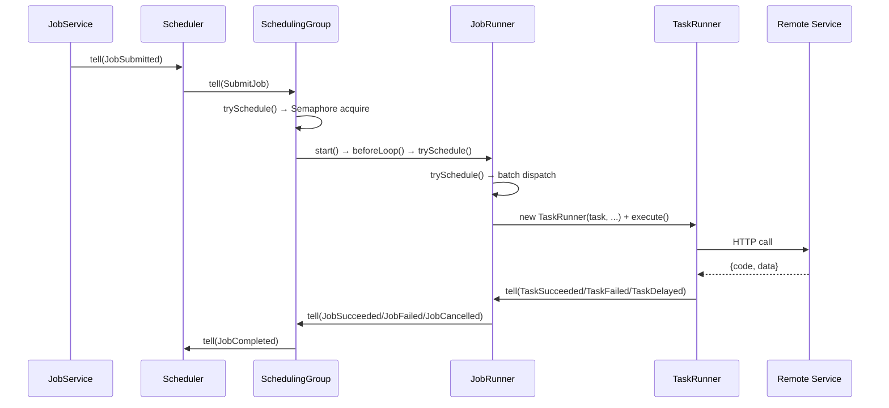

# 调度引擎设计

## 概述

调度引擎是 Fizz 的核心组件，位于 `fizz-core` 模块的 `engine/runtime` 包中。采用 **Actor Model** 风格设计，每个组件由一个虚拟线程驱动，通过 inbox + event loop 处理消息。

### 组件树

```
SchedulerCoordinator  (非 Actor, leader 锁循环)
  └→ Scheduler  (根调度器，1 实例)
       └── SchedulingGroup  (每 tenant + jobType 1 个，空闲自毁)
            ├── JobRunner  (每 Job 1 个，运行时存在)
            │   ├── TaskRunner  (每 Task 1 个，vthread 驱动)
            │   └── TaskRunner ...
            └── JobRunner ...
```

### Actor 基类

```java
public abstract class Actor {
    protected final BlockingQueue<Object> inbox = new LinkedBlockingQueue<>();

    // 非阻塞：将消息投递到 inbox 并唤醒组件线程
    public void tell(Object message);

    // 非阻塞：启动虚拟线程，执行 beforeLoop() → eventLoop()
    public void start();

    // 非阻塞：设置 running=false，unpark 线程让其退出
    public void shutdown();

    // 阻塞：等待子组件和自身线程全部退出
    public abstract void awaitTermination(long timeoutMs);

    // event loop: inbox.poll(timeout) → handle(message) → onIdle()
}
```

## 通讯模式

- **Parent → Child**：直接调用 child 的方法（内部 post 到 child 的 inbox），如 `jr.start()` 后 `beforeLoop()` 自动触发调度
- **Child → Parent**：通过构造时注入的 parent 引用调用 `parent.tell(message)`

无中心化 EventBus，通讯链路清晰。

## 核心组件

### Scheduler — 根调度器

```java
public class Scheduler extends Actor {
    // 子组件
    private final Map<String, SchedulingGroup> groups;
    private volatile boolean dispatchable;

    // 接收 SchedulerCoordinator 消息
    handle(LockAcquired)  → dispatchable=true, 执行恢复流程
    handle(LockLost)      → dispatchable=false, 清理所有 SchedulingGroup

    // 接收外部消息（仅 dispatchable 时处理）
    handle(JobSubmitted)  → 路由到 SchedulingGroup（懒创建）
    handle(JobCompleted)  → 调用 NotificationDispatcher
    handle(CancelJob)     → 转发到 SchedulingGroup
    handle(GroupDead)     → 移除 SchedulingGroup

    // 恢复流程（LockAcquired 时触发）
    doRecovery() → recoverDanglingTasks → 读 ActiveJob → 重统计 Task 计数
                   → 重置 RUNNING → PENDING → 更新 Job status + counts
                   → 按 (tenantId, jobType) 分组创建 SchedulingGroup → submit 所有 Job
}
```

Leader 选举由独立的 `SchedulerCoordinator` 处理，通过消息与 Scheduler 通信。Scheduler 无 `onIdle` 心跳逻辑。

### SchedulingGroup — 调度组（按 tenant + jobType 分组）

```java
public class SchedulingGroup extends Actor {
    private final Semaphore jobSlots;    // 内存槽位，大小 = jobConcurrency
    private final Queue<PendingEntry> pendingFifo;
    private final Set<String> runningQueueingKeys; // 运行中的 queueingKey 集合
    private int idleCount;               // 空闲计数（连续 3 次触发自毁）

    handle(SubmitJob)      → 入 FIFO 队列，trySchedule()
    handle(JobSucceeded)   → 移除 runningJob，释放槽位，通知父，trySchedule()
    handle(JobFailed)      → 同上
    handle(JobCancelled)   → 同上
    handle(CancelJob)      → 转发到 JobRunner
    handle(Exit)           → 通知父 GroupDead，退出事件循环

    onIdle() {
        if (pendingFifo 非空 || runningJobs 非空) → trySchedule()
        else {
            idleCount++;
            if (idleCount >= 3) → tell(Exit)  // 空闲自毁
        }
    }

    trySchedule() {
        idleCount = 0;  // 有工作则重置
        while (jobSlots.tryAcquire()) {
            pollEligible() → 检查 scheduledAt + queueingKey 冲突（内存 RunningQueueingKeys）
            → DB: PENDING → RUNNING
            → 创建 JobRunner, start()（beforeLoop 自动触发调度）
        }
    }
}
```

**空闲自毁**：连续 3 次 onIdle（约 3 分钟无活动）后，向自身发送 Exit 消息，通知父 Scheduler GroupDead，事件循环退出。新 Job 到达时由 Scheduler 重新创建。

**QueueingKey 串行约束**：通过内存 `runningQueueingKeys` 集合跟踪运行中的 key，无需每次查 DB。

### JobRunner — 作业执行组件

```java
public class JobRunner extends Actor {
    private int pendingTaskCount;                    // 待调度的 PENDING task 数量
    private final Set<String> runningTasks;          // 运行中的 taskId
    private final PriorityQueue<DelayedEntry> delayedTasks; // 延迟任务队列（按 availableAt 排序）

    beforeLoop()              → 计算 pendingTaskCount + trySchedule()  // 构造后自动触发
    handle(TaskSucceeded)    → 移除 runningTask, completedCount++, trySchedule()
    handle(TaskFailed)       → 移除 runningTask, failedCount++, trySchedule()
    handle(TaskDelayed)      → 移除 runningTask, 放入 delayedTasks, trySchedule()
    handle(Cancel)           → 取消 PENDING tasks + cancel 所有运行中的 TaskRunner

    trySchedule() {
        if (cancelled && runningTasks 空) → 通知父 JobCancelled, 退出
        if (pendingTaskCount<=0 && delayedTasks 空 && runningTasks 空)
            → 判定终态 → 通知父 JobSucceeded/JobFailed, 退出

        // 批量从 DB 获取 PENDING task
        while (runningTasks.size < taskConcurrency && pendingTaskCount > 0) {
            DB: fetch (taskConcurrency-running) 个 PENDING task
            → mark RUNNING → pendingTaskCount--
            → new TaskRunner(task, ...).execute()
        }

        // 从延迟队列获取可用 task
        while (runningTasks.size < taskConcurrency && !delayedTasks.isEmpty()) {
            poll 延迟队列（availableAt <= now）
            → mark RUNNING → new TaskRunner(task, ...).execute()
        }
    }
}
```

**Dispatch 策略**：先批量从 DB 获取新 PENDING task，再处理延迟队列。pendingTaskCount 在激活时由 `countByJobIdAndStatus(PENDING)` 计算一次，每次 dispatch 递减，避免重复 DB 计数查询。

**延迟任务**：TaskRunner 返回 IN_PROGRESS 后，task 放入内存 `DelayedTasks` 优先队列（按 `availableAt` 排序）。调度流程在 DB 派发完毕后逐一 poll 到期的延迟任务。

**作业完成判定**：`pendingTaskCount <= 0 && delayedTasks 为空 && runningTasks 为空` 时判定终态（SUCCESS / FAILED）。不再使用 `completed + failed >= total` 比较。

### TaskRunner — 任务执行单元

```java
public class TaskRunner {
    // 构造注入
    private final String taskId, jobId, params;
    private final int maxAttempts;
    private final JobTypeConfig config;
    private final ServiceEndpoint endpoint;
    private final TaskInvoker taskInvoker;
    private final Actor parent;
    private final TaskStore taskStore;

    public TaskRunner(Task task, int maxAttempts, JobTypeConfig config,
                       ServiceEndpoint endpoint, TaskInvoker taskInvoker,
                       Actor parent, TaskStore taskStore) {
        this.taskId = task.getId();
        this.jobId = task.getJobId();
        this.params = task.getParams();
        // ...
    }

    public void execute() {
        taskThread = Thread.ofVirtual().start(() -> {
            int attempts = 0;
            while (!cancelled && (maxAttempts == -1 || attempts < maxAttempts)) {
                TaskResult result = taskInvoker.invoke(endpoint, config.taskPath(),
                        config.httpMethod(), params, config.timeoutMs());
                persist(attempts, result);            // 持久化到 DB
                switch (result.status()) {
                    case SUCCESS → parent.tell(TaskSucceeded) + return;
                    case FAILED  → attempts++ → 重试或终态 parent.tell(TaskFailed);
                    case IN_PROGRESS → parent.tell(TaskDelayed) + return;  // break 退出线程
                }
            }
        });
    }
}
```

**状态持久化**：每次 HTTP 调用后调用 `persist()` 更新 `fizz_task` 表的 `attempts`、`last_result`、`last_error`。

- SUCCESS → status = SUCCESS（终态），vthread 退出
- FAILED（未用尽重试）→ status 保持 RUNNING（TaskRunner 虚拟线程自循环重试，不回到 PENDING）
- IN_PROGRESS → status = PENDING（持久化到 DB 并 break 退出 vthread，由 JobRunner 的 DelayedTasks 队列在 retryAfter 到期后重新调度）
- FAILED（用尽重试）→ status = FAILED（终态），vthread 退出

> 与旧版的关键区别：IN_PROGRESS 后 **vthread 退出**（break 循环），不再 park 等待后继续在同一线程内重试。重试由 JobRunner 的调度流程通过 DelayedTasks 队列重新创建 TaskRunner 执行。

**退出**：`cancel()` 设置 cancelled=true + unpark 执行线程 → 线程在下次循环检查时退出。

## 并行度控制

使用**内存 Semaphore + 计数器**：

| 级别 | 控制者 | 机制 |
|------|--------|------|
| Job 并发 | SchedulingGroup | `Semaphore(jobConcurrency)` |
| Task 并发 | JobRunner | `runningTasks.size() < taskConcurrency` 条件判断 |

## 事件驱动

每个组件独立 event loop，通过 `inbox.poll(timeout)` + `tell()` + `LockSupport.unpark/park` 实现事件驱动：

- 新作业提交 → JobService → scheduler.tell(JobSubmitted)
- 任务成功 → TaskRunner → parent.tell(TaskSucceeded)
- 任务失败 → TaskRunner → parent.tell(TaskFailed)
- 任务延迟 → TaskRunner → parent.tell(TaskDelayed)
- 作业成功 → JobRunner → parent.tell(JobSucceeded)
- 作业失败 → JobRunner → parent.tell(JobFailed)
- 作业取消 → JobRunner → parent.tell(JobCancelled)
- 取消作业 → JobService → scheduler.tell(CancelJob) → 级联到 JobRunner
- Leader 变更 → SchedulerCoordinator → scheduler.tell(LockAcquired/LockLost)

无需集中轮询循环。空闲时组件 park 在 inbox 上，有消息时被 unpark。

## 虚拟线程

- 每个 Actor 实例：1 个虚拟线程（event loop）
- `SchedulerCoordinator`：1 个虚拟线程（leader 锁循环，非 Actor）
- 每个 `TaskRunner.execute()`：1 个虚拟线程（HTTP 调用 + 重试循环，IN_PROGRESS 时退出）
- `NotificationDispatcher`：fork 虚拟线程发送 HTTP 通知
- 并行度由 Semaphore / 计数器控制，不在线程池层面限制

## 调度时序


