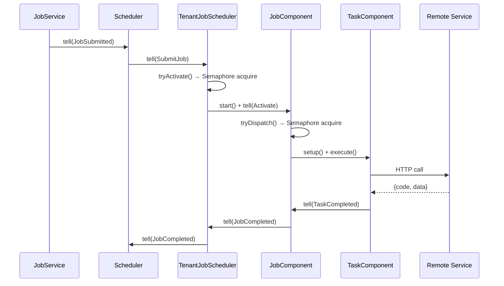

# 调度引擎设计

## 概述

调度引擎是 Fizz 的核心组件，位于 `fizz-core` 模块的 `engine/component` 包中。采用 **Actor Model** 风格设计，每个组件由一个虚拟线程驱动，通过 inbox + event loop 处理消息。

### 组件树

```
Scheduler  (根调度器，1 实例，Leader only)
  ├── TenantJobScheduler  (每 tenant + jobType 1 个，懒创建常驻)
  │   ├── JobComponent  (每 Job 1 个，运行时存在)
  │   │   ├── TaskComponent  (每 Task 1 个，vthread 驱动)
  │   │   └── TaskComponent ...
  │   └── JobComponent ...
  └── TenantJobScheduler ...
```

### Component 基类

```java
public abstract class Component {
    protected final BlockingQueue<Object> inbox = new LinkedBlockingQueue<>();

    // 非阻塞：将消息投递到 inbox 并唤醒组件线程
    public void tell(Object message);

    // 非阻塞：启动虚拟线程，执行 beforeLoop() → eventLoop()
    public void start();

    // 非阻塞：设置 running=false，unpark 线程让其退出
    public void shutdown();

    // 阻塞：等待子组件和自身线程全部退出
    public abstract void awaitTermination(long timeoutMs);

    // event loop: inbox.poll(timeout) → handle(message) → onIdle()
}
```

## 通讯模式

- **Parent → Child**：直接调用 child 的方法（内部 post 到 child 的 inbox），如 `job.activate(...)`
- **Child → Parent**：通过构造时注入的 parent 引用调用 `parent.tell(message)`

无中心化 EventBus，通讯链路清晰。

## 核心组件

### Scheduler — 根调度器

```java
public class Scheduler extends Component {
    // 子组件
    private final Map<String, TenantJobScheduler> tenants;

    // 接收消息
    handle(JobSubmitted)  → 路由到 TenantJobScheduler（懒创建）
    handle(JobCompleted)  → 调用 NotificationDispatcher
    handle(CancelJob)     → 转发到 TenantJobScheduler

    // Leader 选举（beforeLoop 中）
    recover() → tryAcquire leader lock → recoverDanglingTasks → 加载 ActiveJob → 重建组件树

    // 空闲时（onIdle）
    heartbeat() / tryAcquireLeader()
}
```

**延迟作业**：`TenantJobScheduler.pollEligible()` 检查 `scheduledAt`，未到期则跳过。

**退出**：
```
shutdown()             → running=false + 级联 tenants.shutdown()
awaitTermination(30s)  → for tenants: tenant.awaitTermination() + joinSelf(30s) + DB cleanup
```

### TenantJobScheduler — 租户+类型调度器

```java
public class TenantJobScheduler extends Component {
    private final Semaphore jobSlots;    // 内存槽位，大小 = jobConcurrency
    private final Queue<PendingEntry> pendingFifo;

    handle(SubmitJob)     → 入 FIFO 队列，tryActivate()
    handle(JobCompleted)  → 释放槽位，通知父 + 尝试激活下一个
    handle(CancelJob)     → 转发到 JobComponent

    tryActivate() {
        while (jobSlots.tryAcquire()) {
            pollEligible() → 检查 scheduledAt + queueingKey 冲突
            → DB: PENDING → RUNNING
            → 创建 JobComponent, start(), activate()
        }
    }
}
```

### JobComponent — 作业组件

```java
public class JobComponent extends Component {
    private final Semaphore taskSlots;  // 内存槽位，大小 = taskConcurrency

    handle(Activate)        → 初始化槽位 + tryDispatch()
    handle(TaskCompleted)   → 更新计数器 + 释放槽位 + checkCompletion() + tryDispatch()
    handle(TaskCancelled)   → 释放槽位 + checkCompletion()
    handle(Cancel)          → 取消 PENDING tasks + cancel 所有运行中的 TaskComponent

    tryDispatch() {
        while (taskSlots.tryAcquire()) {
            DB: fetch PENDING task → mark RUNNING
            → TaskComponent.setup(...).execute()
        }
    }
}
```

**作业完成判定**：`completedCount + failedCount >= totalCount` 时判定终态（SUCCESS / FAILED / CANCELLED）。

### TaskComponent — 任务执行单元

```java
public class TaskComponent {
    // 执行上下文（setup 时注入）
    private String taskId, jobId, params;
    private int maxAttempts;
    private JobTypeConfig config;
    private ServiceEndpoint endpoint;
    private HttpClient httpClient;
    private Component parent;
    private TaskStore taskStore;

    public void execute() {
        taskThread = Thread.ofVirtual().start(() -> {
            int attempts = 0;
            while (!cancelled && (maxAttempts == -1 || attempts < maxAttempts)) {
                TaskResult result = executeHttp();    // HTTP 调用
                persist(attempts, result);            // 持久化到 DB
                switch (result.status()) {
                    case SUCCESS → parent.tell(TaskCompleted);
                    case FAILED  → attempts++ → 重试或终态;
                    case IN_PROGRESS → 退避等待后重试;
                }
            }
        });
    }
}
```

**状态持久化**：每次 HTTP 调用后调用 `persist()` 更新 `fizz_task` 表的 `attempts`、`last_result`、`last_error`。

- SUCCESS → status = SUCCESS（终态）
- FAILED（未用尽重试）→ status 保持 RUNNING（TaskComponent 虚拟线程自循环重试，不回到 PENDING）
- IN_PROGRESS → status = PENDING（释放虚拟线程，等待 retryAfter 后由 `findDispatchable` 重新分发）
- FAILED（用尽重试）→ status = FAILED（终态）

**退出**：`cancel()` 设置 cancelled=true + unpark 执行线程 → 线程在下次循环检查时退出。

## 并行度控制

使用**内存 Semaphore**：

| 级别 | 控制者 | 机制 |
|------|--------|------|
| Job 并发 | TenantJobScheduler | `Semaphore(jobConcurrency)` |
| Task 并发 | JobComponent | `Semaphore(taskConcurrency)` |

## 事件驱动

每个组件独立 event loop，通过 `inbox.poll(timeout)` + `tell()` + `LockSupport.unpark/park` 实现事件驱动：

- 新作业提交 → JobService → scheduler.tell(JobSubmitted)
- 任务完成 → TaskComponent → parent.tell(TaskCompleted)
- 作业完成 → JobComponent → parent.tell(JobCompleted)
- 取消作业 → JobService → scheduler.tell(CancelJob) → 级联到 JobComponent

无需集中轮询循环。空闲时组件 park 在 inbox 上，有消息时被 unpark。

## 虚拟线程

- 每个 Component 实例：1 个虚拟线程（event loop）
- 每个 TaskComponent.execute()：1 个虚拟线程（HTTP 调用 + 重试循环）
- NotificationDispatcher：fork 虚拟线程发送 HTTP 通知
- 并行度由 Semaphore 控制，不在线程池层面限制

## 调度时序


