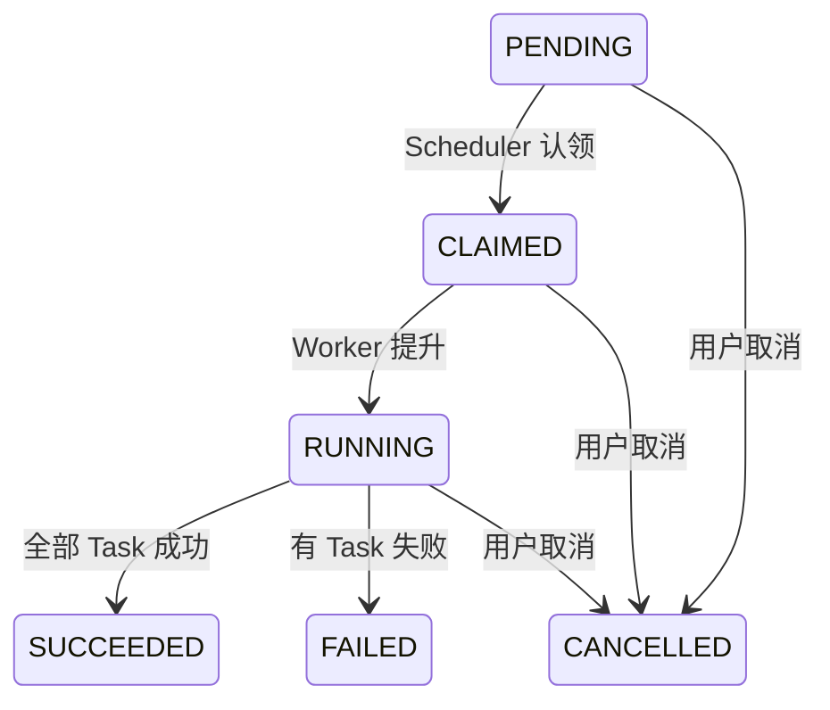
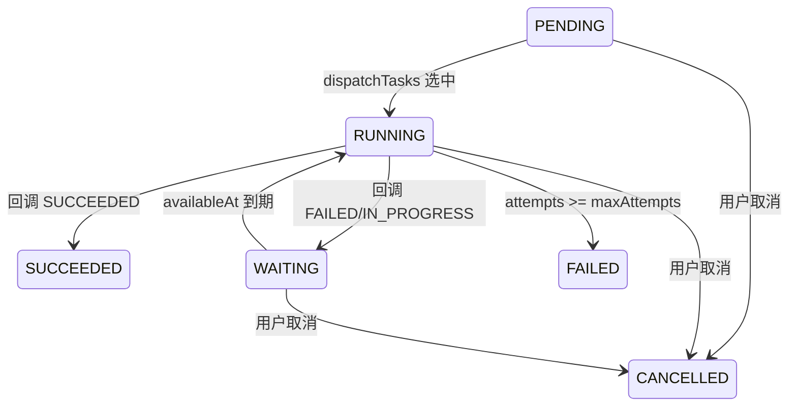

# 调度规则

## 架构概览

```
JobService.create() → Scheduler.schedule() → claimPendingJobs() → Worker.assign()
                                                                    ├─ promoteJobs()
                                                                    └─ dispatchTasks()
```

- **Scheduler**: 全局单例，负责分布式锁、作业认领、Worker 创建与路由
- **Worker**: 每 `租户-作业类型` 一个，负责任务派发、重试、并发控制、作业生命周期
- **EventLoop**: 单线程虚拟线程事件循环，所有状态变更在 EventLoop 内完成

---

## 状态机

### 作业状态 (JobStatus)



| 转移 | 触发 |
|------|------|
| PENDING → CLAIMED | Scheduler 成功认领 |
| CLAIMED → RUNNING | Worker 首次提升作业 (promoteJobs) |
| RUNNING → SUCCEEDED | 所有 Task 均为 SUCCEEDED |
| RUNNING → FAILED | 有 Task 为 FAILED 且无 CANCELLED |
| RUNNING → CANCELLED | 用户取消 或 有 Task 被取消 |
| 任意非终态 → CANCELLED | 用户取消 |

### 任务状态 (TaskStatus)



| 转移 | 触发 |
|------|------|
| PENDING → RUNNING | dispatchTasks 选中并 claim |
| WAITING → RUNNING | dispatchTasks 选中 (availableAt 已到期) |
| RUNNING → SUCCEEDED | 回调返回 SUCCEEDED |
| RUNNING → WAITING | 回调返回 FAILED(可重试) 或 IN_PROGRESS |
| RUNNING → FAILED | 回调返回 FAILED 且 attempts >= maxAttempts |
| PENDING/RUNNING/WAITING → CANCELLED | 用户取消 |

---

## 并行度控制

### 作业级并发 (jobConcurrency)

- 配置: `JobType.jobConcurrency`
- 控制: `runningJobs.size()` 不超过 `jobConcurrency`
- `assignedJobs` 中未活跃的作业不占用配额
- WAITING 作业 (全部任务等待中) 在**有其他作业排队时**释放槽位

### 任务级并发 (taskConcurrency)

- 取值优先级: Job.taskConcurrency > JobType.taskConcurrency
- 控制: `ctx.futures.size()` 不超过 `taskConcurrency`
- 每完成一个任务释放一个槽位，触发 TryDispatch 补派

### MutexKey 互斥

- 配置: `Job.mutexKey`
- 同一 Worker 内，相同 mutexKey 的作业同时只能有一个活跃
- `runningMutexKeys` 跟踪已占用 key
- 无 mutexKey 的作业不受此约束

---

## 调度条件

### 作业提升 (promoteJobs)

作业从 `assignedJobs`(等待) 提升到 `runningJobs`(活跃) 需**同时满足**:

| # | 条件 | 不满足行为 |
|---|------|-----------|
| 1 | `runningJobs.size() < jobConcurrency` | 停止遍历 (break) |
| 2 | `scheduledAt == null 或 scheduledAt <= now` | 跳过 (continue) |
| 3 | `mutexKey == null 或 !runningMutexKeys.contains(mutexKey)` | 跳过 (continue) |
| 4 | `healthTracker.isAvailable(serviceName)` | 停止遍历 (break) |
| 5 | 惰性加载 tasks 后存在就绪任务 (PENDING 或 WAITING 且 availableAt <= now) | 跳过 (continue) |

### 任务派发 (dispatchTasks)

对每个活跃作业，**同时满足**:

| # | 条件 |
|---|------|
| 1 | `ctx.futures.size() < taskConcurrency` |
| 2 | 存在 PENDING 或 WAITING 任务且 `availableAt <= now` |
| 3 | `healthTracker.isAvailable(serviceName)` (派发前守卫) |

---

## 回调与重试

### 回调结果

| 服务返回 | TaskResultStatus | 行为 |
|----------|------------------|------|
| `{"code":0,"data":{"status":"SUCCEEDED"}}` | SUCCEEDED | 标记成功，succeededCount++ |
| `{"code":0,"data":{"status":"FAILED"}}` | FAILED | 判断重试 |
| `{"code":0,"data":{"status":"IN_PROGRESS","retryAfter":"..."}}` | IN_PROGRESS | 按 retryAfter 等待后重试 |
| HTTP 非 2xx / 超时 / 异常 | (error) | 按 FAILED 处理 |

### 重试判定

Task 当前 attempt = N:

| maxAttempts | N < maxAttempts? | 结果 |
|-------------|------------------|------|
| -1 (无限) | 永远可重试 | → WAITING, availableAt = now + backoff |
| 正整数 M | N < M → 可重试 | → WAITING, availableAt = now + backoff |
| 正整数 M | N >= M → 耗尽 | → FAILED, failedCount++ |

### 退避策略 (BackoffStrategy)

提交作业时可指定 `maxAttempts` 覆盖作业类型默认值。

| 策略 | 计算公式 |
|------|---------|
| FIXED | `delayMs = backoffInitialMs` |
| EXPONENTIAL | `delayMs = min(backoffInitialMs * 2^(attempt-1), backoffMaxMs)` |

---

## 服务健康检查

| 项目 | 值 |
|------|-----|
| 不可用阈值 | 连续 5 次失败 |
| 恢复方式 | 惰性恢复 (isAvailable 调用时检查) |
| 恢复时长 | 标记不可用后 60 秒 |
| 成功回调 | 立即清零失败计数并恢复可用 |

---

## 作业取消

| 当前状态 | 处理 |
|----------|------|
| PENDING | 直接 DB 操作: tasks→CANCELLED, job→CANCELLED, 删除 active_job |
| CLAIMED / RUNNING | 路由到 Worker→取消所有 in-flight Future→DB 批量取消任务→completeJob |

---

## 启动恢复

Scheduler 获取锁成功后执行 `recoverActiveJobs()`:

1. 查询 `fizz_job` 中所有活跃作业 (非 PENDING 状态)
2. 重新统计 each job 的 SUCCEEDED/FAILED/CANCELLED 计数
3. 终态数量达标 → finalize (SUCCEEDED/FAILED/CANCELLED)
4. 否则 → 重置 RUNNING/WAITING 任务为 PENDING, 作业状态复原为 PENDING

---

## 内存模型 (Worker)

```
assignedJobs     Map<jobId, JobContext>    已分配的**所有**作业
  └─ runningJobs   Map<jobId, JobContext>    assignedJobs 中活跃的子集

runningMutexKeys  Set<String>               runningJobs 中的 mutexKey 集合

JobContext {
    job:      JobEntity                   作业元数据
    tasks:    Map<taskId, TaskEntity>      惰性加载的非终态任务
    futures:  Map<taskId, CF<TaskResult>>  正在执行的 HTTP 调用的 Future
    active:   boolean                     是否在 runningJobs 中
    tasksLoaded: boolean                  是否已完成惰性加载
}
```

---

## EventLoop 事件

| 事件 | 来源 | 处理 |
|------|------|------|
| `Started` | EventLoop 启动 | tryDispatch |
| `Idle` | 事件队列超时空闲 | tryDispatch |
| `PreShutdown` | shutdown 请求 | 取消所有 in-flight Future |
| `Terminated` | EventLoop 退出 | 清理 |
| `JobAssigned` | Scheduler.assign | 加入 assignedJobs → TryDispatch |
| `CancelJobRequest` | Scheduler.cancel | 取消任务 + completeJob |
| `TryDispatch` | 各种触发点 | promoteJobs + dispatchTasks |
| `TaskCompleted` | HTTP 回调完成 | 处理结果 + TryDispatch |
